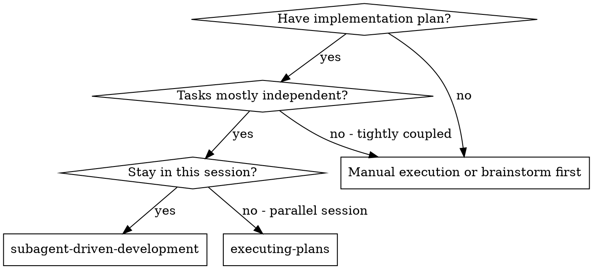
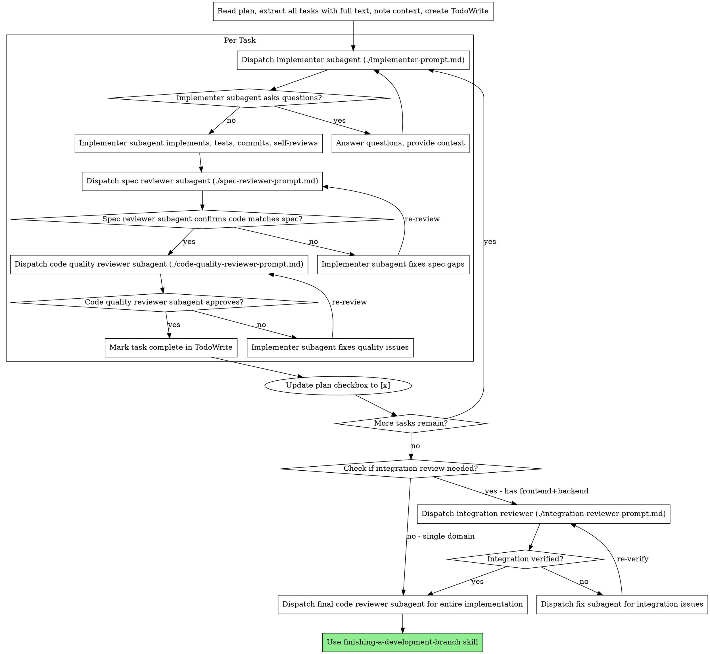

# Subagent-Driven Development

Execute plan by dispatching fresh subagent per task, with two-stage review after each: spec compliance review first, then code quality review.

**Why subagents:** You delegate tasks to specialized agents with isolated context. By precisely crafting their instructions and context, you ensure they stay focused and succeed at their task. They should never inherit your session's context or history — you construct exactly what they need. This also preserves your own context for coordination work.

**Core principle:** Fresh subagent per task + two-stage review (spec then quality) = high quality, fast iteration

**Commit semantics:** implementer commits are checkpoints for review and rollback. A task is not complete until both review stages pass.

**Progress tracking:** After a task passes both reviews, update `implementation-plan.md`:
1. Add test summary under the task:
   ```markdown
   - [x] Task N: [description]
     **Tests:**
     - ✓ [test case 1]
     - ✓ [test case 2]
     **Test file:** `path/to/test.file`
     **Commit:** [SHA]
   ```
2. Mark task checkbox as `[x]`

This enables cross-session recovery — a new session can skip completed tasks and see what was tested.

## When to Use



**vs. Executing Plans (parallel session):**
- Same session (no context switch)
- Fresh subagent per task (no context pollution)
- Two-stage review after each task: spec compliance first, then code quality
- Faster iteration (no human-in-loop between tasks)

## The Process



---

## Lifecycle Management in Practice

**After every subagent dispatch, you MUST follow this sequence:**

```
Dispatch subagent
    ↓
Wait for result (blocks until complete)
    ↓
Process result (extract status, files, commits, concerns)
    ↓
✅ CLEANUP CHECKPOINT ✅
    ├─ Codex: Execute close_agent(agent_id)
    ├─ Claude Code: No action (auto-closed)
    └─ Log: "Closed [role] subagent"
    ↓
Update tracking (plan file, TodoWrite)
    ↓
Decide next action based on result
    ↓
(If need another subagent) Pre-dispatch check → Dispatch next
```

### Pre-dispatch Check (BEFORE every new dispatch)

```markdown
Before dispatching [role] subagent:
- [ ] Active subagent count: [should be 0 or low]
- [ ] Any completed subagents unclosed? → Close them now
- [ ] Platform: [Codex/Claude Code/Unknown]
- [ ] Cleanup mode: [explicit/auto/fallback]
- [ ] Ready to dispatch: ✅
```

### Concrete Example: Task 1 Execution Lifecycle

**Context:** Implementing Task 1 on Codex platform

```
Step 1: Dispatch implementer
    → spawn_agent(prompt="Implement Task 1...") [Codex]
    → agent_id = "agent_123"
    → Log: "Dispatched implementer: agent_123"

Step 2: Wait for implementer
    → wait(agent_id="agent_123")
    → Result: {status: DONE, files: [...], commit: "abc123", ...}

Step 3: Process result
    → Extract: status=DONE, files=[...], commit="abc123"
    → Update TodoWrite: Task 1 status = "implemented, awaiting review"

Step 4: ✅ CLEANUP CHECKPOINT ✅
    → close_agent("agent_123") [Codex]
    → Log: "Closed implementer: agent_123"
    → Active count: 0

Step 5: Pre-dispatch check (before spec reviewer)
    → Active count: 0 ✅
    → No completed unclosed ✅
    → Ready to dispatch spec reviewer ✅

Step 6: Dispatch spec reviewer
    → spawn_agent(prompt="Review Task 1...") [Codex]
    → agent_id = "agent_456"
    → Log: "Dispatched spec_reviewer: agent_456"

[Repeat Steps 2-5 for spec reviewer...]

Step 7: Spec review result = Pass
    → Close spec reviewer (agent_456)
    → Pre-dispatch check before code quality reviewer
    → Dispatch code quality reviewer

[Repeat for code quality reviewer...]

Step 8: Code quality review result = Pass
    → Close code quality reviewer
    → Mark Task 1 complete
    → Update plan file: [x] Task 1
    → Pre-dispatch check before Task 2 implementer
    → Dispatch Task 2 implementer

[Continue to next task...]
```

**Key observations:**
- Every subagent is closed **immediately** after processing its result
- Pre-dispatch check runs **before every new dispatch**
- Active subagent count stays at 0 between dispatches
- Audit log shows clear dispatch → close pairs

---

## Model Selection

Use the least powerful model that can handle each role to conserve cost and increase speed.

**Mechanical implementation tasks** (isolated functions, clear specs, 1-2 files): use a fast, cheap model. Most implementation tasks are mechanical when the plan is well-specified.

**Integration and judgment tasks** (multi-file coordination, pattern matching, debugging): use a standard model.

**Architecture, design, and review tasks**: use the most capable available model.

**Task complexity signals:**
- Touches 1-2 files with a complete spec → cheap model
- Touches multiple files with integration concerns → standard model
- Requires design judgment or broad codebase understanding → most capable model

---

## Review Track Selection (Smart Routing)

**BEFORE starting task implementation**, analyze each task to select the appropriate review track.

Use the `review-fix-strategy` skill's Track Selection criteria:

**Fast Track** (Code Quality only):
- Single file < 50 lines
- No new API/interface
- No architecture changes
- Pure function/utility
→ Skip spec review, only code quality review

**Standard Track** (Spec + Code Quality):
- Multi-file changes
- New API/business logic
- Typical feature work
→ Full two-stage review

**Heavy Track** (Spec + Code + Integration):
- Cross-domain (frontend + backend)
- Architecture changes
- Security-sensitive
→ Three-stage review including integration check

### Track Assignment Process

```
Before Task 1 implementation:
1. Read task description
2. Count affected files
3. Estimate lines changed
4. Check for API changes
5. Check for cross-domain
6. Assign track: Fast/Standard/Heavy
7. Log assignment with reasoning
8. Store track in task metadata
```

### Example Track Assignment

```markdown
**Review Track Assignments:**

Task 1: Add input validation → Fast Track
  Reason: Single file (validators.ts), ~30 lines, pure utility

Task 2: User profile API → Standard Track
  Reason: 3 files (route/controller/service), new REST API

Task 3: Payment checkout → Heavy Track
  Reason: Cross-domain (frontend form + backend processor), security-sensitive
```

### Using Track During Review

When dispatching reviewers:

```
if (task.track == "Fast"):
    skip spec_reviewer
    dispatch code_quality_reviewer only
    max_rounds = 1

elif (task.track == "Standard"):
    dispatch spec_reviewer → code_quality_reviewer
    max_rounds = 2

elif (task.track == "Heavy"):
    dispatch spec_reviewer → code_quality_reviewer → integration_reviewer
    max_rounds = 3
```

## Handling Implementer Status

Implementer subagents report one of four statuses. Handle each appropriately based on the task's review track.

**DONE:** Proceed to review based on track:
- Fast Track → Code Quality Review only
- Standard Track → Spec Compliance Review first
- Heavy Track → Spec Compliance Review first

**DONE_WITH_CONCERNS:** The implementer completed the work but flagged doubts. Read the concerns before proceeding. If the concerns are about correctness or scope, address them before review. If they're observations (e.g., "this file is getting large"), note them and proceed to review.

**NEEDS_CONTEXT:** The implementer needs information that wasn't provided. Provide the missing context and re-dispatch.

**BLOCKED:** The implementer cannot complete the task. Assess the blocker:
1. If it's a context problem, provide more context and re-dispatch with the same model
2. If the task requires more reasoning, re-dispatch with a more capable model
3. If the task is too large, break it into smaller pieces
4. If the plan itself is wrong, escalate to the human

**Never** ignore an escalation or force the same model to retry without changes. If the implementer said it's stuck, something needs to change.

## Handling Review Failures

When a reviewer (unified, spec, or code quality) reports issues, follow this process:

**1. Assess Severity (orchestrator decision):**
- Read the review report
- Classify issues using `review-fix-strategy` Skill criteria:
  - **Minor**: Small patches (naming, magic numbers, missing checks)
  - **Important**: Targeted refactoring (code smells, maintainability)
  - **Critical**: Wrong approach (security flaws, incorrect algorithm, missing core requirements)

**2. Dispatch Fix Agent:**
```
Task tool:
  description: "Fix review issues"
  prompt: [content from fix-agent-prompt.md]
  input:
    - review_report: [full review output]
    - severity: "Minor" | "Important" | "Critical"
    - task_description: [original task context]
    - working_directory: [project root]
    - (For Minor/Important): relevant_files + checkpoint_commit
    - (For Critical): design_spec + NO original code
  subagent_type: "general-purpose"
```

**3. Process Fix Agent Result:**
- **DONE**: Fix agent created fix commit
  - Close fix agent immediately
  - Dispatch **new reviewer instance** for re-review (fresh perspective)
  - Max 2-3 rounds depending on review track (see agentic-delivery/SKILL.md § Stage 6)
- **BLOCKED**: Fix agent needs user decision
  - Close fix agent immediately
  - Escalate to user with fix agent's questions
  - User provides decision → re-dispatch fix agent or modify approach

**4. Max Rounds Exceeded:**
- Fast Track: 1 round → escalate
- Standard Track: 2 rounds → escalate
- Heavy Track: 3 rounds → escalate

See `review-fix-strategy/SKILL.md` for detailed fix strategy selection logic.

## Prompt Templates

- `./implementer-prompt.md` - Dispatch implementer subagent
- `./unified-reviewer-prompt.md` - **RECOMMENDED:** Dispatch unified reviewer (spec + quality in one call)
- `./spec-reviewer-prompt.md` - Dispatch spec compliance reviewer subagent (if using sequential strategy)
- `./code-quality-reviewer-prompt.md` - Dispatch code quality reviewer subagent (if using sequential strategy)
- `./integration-reviewer-prompt.md` - Dispatch integration reviewer subagent (for multi-domain plans)
- `./fix-agent-prompt.md` - Dispatch fix agent subagent (when review fails, dispatched by orchestrator)

## Integration Review (for Multi-Domain Plans)

**Trigger condition:** Plan contains 2+ tasks split across different domains (e.g., frontend + backend)

**When:** After all individual task reviews pass, before final code review

**Purpose:** Verify that implementations from different domains can integrate successfully

### What Integration Review Checks

**1. API Contract Consistency**
- Backend output format vs Frontend expectations
- Field names match (camelCase vs snake_case)
- Types match (string vs number)
- Response structures align
- Status codes consistent

**2. Data Flow Completeness**
- All APIs defined in spec are implemented
- All implemented APIs are called by frontend
- CRUD operations complete (create/read/update/delete)
- No missing endpoints on either side

**3. Error Handling Alignment**
- Backend error codes vs Frontend error handling
- All backend error types (400, 401, 403, 404, 409, 500) handled by frontend
- Error response formats consistent

### Integration Review Process

```
All task reviews passed ✓
  ↓
Check: Plan has frontend + backend split?
  ↓ yes
Dispatch Integration Reviewer
  Input:
  - Design spec (API contract section)
  - Backend task git diffs
  - Frontend task git diffs
  ↓
Integration Reviewer checks:
  - API contract consistency
  - Data flow completeness
  - Error handling alignment
  ↓
✅ Verified → Proceed to final review
❌ Issues found → Dispatch fix subagent → Re-verify
```

**Cost:** ~300-500 tokens (reviews 2 git diffs + spec)

**Benefit:** Catches integration issues before runtime (field name mismatches, missing API calls, unhandled error codes)

**Example Issues Caught:**
- Backend returns `{ userId: 1 }`, Frontend expects `{ user_id: 1 }`
- DELETE /api/skills implemented but never called by frontend
- Backend returns 409 Conflict, Frontend only handles 400/500

## Example Workflow

```
You: I'm using Subagent-Driven Development to execute this plan.

[Read plan file once: docs/superpowers/plans/feature-plan.md]
[Extract all 5 tasks with full text and context]
[Create TodoWrite with all tasks]

Task 1: Hook installation script

[Get Task 1 text and context (already extracted)]
[Dispatch implementation subagent with full task text + context]

Implementer: "Before I begin - should the hook be installed at user or system level?"

You: "User level (~/.config/superpowers/hooks/)"

Implementer: "Got it. Implementing now..."
[Later] Implementer:
  - Implemented install-hook command
  - Added tests, 5/5 passing
  - Self-review: Found I missed --force flag, added it
  - Committed checkpoint

[Dispatch spec compliance reviewer]
Spec reviewer: ✅ Spec compliant - all requirements met, nothing extra

[Get git SHAs, dispatch code quality reviewer]
Code reviewer: Strengths: Good test coverage, clean. Issues: None. Approved.

[Update implementation-plan.md for Task 1:]
- [x] Task 1: Hook installation script
  **Tests:**
  - ✓ Install hook to user config directory
  - ✓ Handle existing hook with --force flag
  - ✓ Reject invalid hook paths
  - ✓ Create config directory if missing
  - ✓ Verify hook permissions after install
  **Test file:** `tests/hook-install.test.ts`
  **Commit:** a7981ec

Task 2: Recovery modes

[Get Task 2 text and context (already extracted)]
[Dispatch implementation subagent with full task text + context]

Implementer: [No questions, proceeds]
Implementer:
  - Added verify/repair modes
  - 8/8 tests passing
  - Self-review: All good
  - Committed checkpoint

[Dispatch spec compliance reviewer]
Spec reviewer: ❌ Issues:
  - Missing: Progress reporting (spec says "report every 100 items")
  - Extra: Added --json flag (not requested)

[Implementer fixes issues]
Implementer: Removed --json flag, added progress reporting

[Spec reviewer reviews again]
Spec reviewer: ✅ Spec compliant now

[Dispatch code quality reviewer]
Code reviewer: Strengths: Solid. Issues (Important): Magic number (100)

[Implementer fixes]
Implementer: Extracted PROGRESS_INTERVAL constant

[Code reviewer reviews again]
Code reviewer: ✅ Approved

[Update implementation-plan.md for Task 2:]
- [x] Task 2: Recovery modes
  **Tests:**
  - ✓ Verify detects all 4 issue types
  - ✓ Repair fixes detected issues
  - ✓ Progress reporting every 100 items
  - ✓ Verify returns exit code 0 when clean
  - ✓ Verify returns exit code 1 when issues found
  - ✓ Repair creates backup before changes
  - ✓ Handle empty database gracefully
  - ✓ Large dataset performance (10k items)
  **Test file:** `tests/recovery.test.ts`
  **Commit:** 3df7661

...

[After all tasks]

**If plan contains frontend + backend tasks:**
[Check integration]
[Dispatch integration reviewer (./integration-reviewer-prompt.md)]
Integration reviewer: Checks API contract consistency, data flow, error handling
  - ✅ Verified → proceed to final review
  - ❌ Issues found → dispatch fix subagent → re-verify

[Dispatch final code-reviewer]
Final reviewer: All requirements met, ready to merge

Done!
```

## Advantages

**vs. Manual execution:**
- Subagents follow TDD naturally
- Fresh context per task (no confusion)
- Parallel-safe (subagents don't interfere)
- Subagent can ask questions (before AND during work)

**vs. Executing Plans:**
- Same session (no handoff)
- Continuous progress (no waiting)
- Review checkpoints automatic

**Efficiency gains:**
- No file reading overhead (controller provides full text)
- Controller curates exactly what context is needed
- Subagent gets complete information upfront
- Questions surfaced before work begins (not after)

**Quality gates:**
- Self-review catches issues before handoff
- Two-stage review: spec compliance, then code quality
- Review loops ensure fixes actually work
- Spec compliance prevents over/under-building
- Code quality ensures implementation is well-built

**Cost:**
- More subagent invocations (implementer + 2 reviewers per task)
- Controller does more prep work (extracting all tasks upfront)
- Review loops add iterations
- But catches issues early (cheaper than debugging later)

## Red Flags

**Never:**
- Start implementation on main/master branch without explicit user consent
- Skip reviews (spec compliance OR code quality)
- Proceed with unfixed issues
- Parallelize tasks that share files, shared state, or integration-order dependencies (these MUST run sequentially)
- Make subagent read plan file (provide full text instead)
- Skip scene-setting context (subagent needs to understand where task fits)
- Ignore subagent questions (answer before letting them proceed)
- Accept "close enough" on spec compliance (spec reviewer found issues = not done)
- Skip review loops (reviewer found issues = implementer fixes = review again)
- Let implementer self-review replace actual review (both are needed)
- **Start code quality review before spec compliance is ✅** (wrong order)
- Move to next task while either review has open issues
- **Skip subagent cleanup after processing result (Codex: missing close_agent)**
- **Dispatch new subagent without pre-dispatch cleanup check**
- **Keep completed subagents open "just in case" (all subagents are stateless)**
- **Wait until dispatch fails before cleanup (reactive, not proactive)**

**If subagent asks questions:**
- Answer clearly and completely
- Provide additional context if needed
- Don't rush them into implementation

**If reviewer finds issues:**
- Dispatch a fresh fix subagent with review report + relevant files (see review-fix-strategy)
- The fix subagent is a new instance — all subagents are stateless
- Fresh reviewer reviews the fix (never reuse reviewers across rounds)
- Repeat until approved or max rounds reached

**If subagent fails task:**
- Dispatch fix subagent with specific instructions
- Don't try to fix manually (context pollution)

## Integration

**Required workflow skills:**
- **using-git-worktrees** *(external, not included)* - REQUIRED: Set up isolated workspace before starting
- **writing-plans** - Creates the plan this skill executes
- **requesting-code-review** - Code review template for reviewer subagents
- **finishing-a-development-branch** - Complete development after all tasks

**Subagents should use:**
- **test-driven-development** *(external, not included)* - Subagents follow TDD for each task

**Alternative workflow:**
- **executing-plans** *(external, not included)* - Use for parallel session instead of same-session execution
